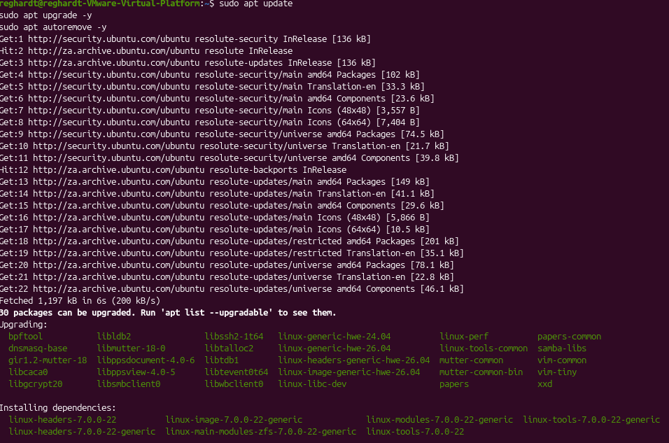

# 01 - Update Ubuntu Server

## Purpose

The Ubuntu server was updated to make sure the system had the latest package information, security updates, and software dependencies before installing the required DevOps tools.

## Commands Used

```bash
sudo apt update
sudo apt upgrade -y# Update Ubuntu Server

## Evidence


